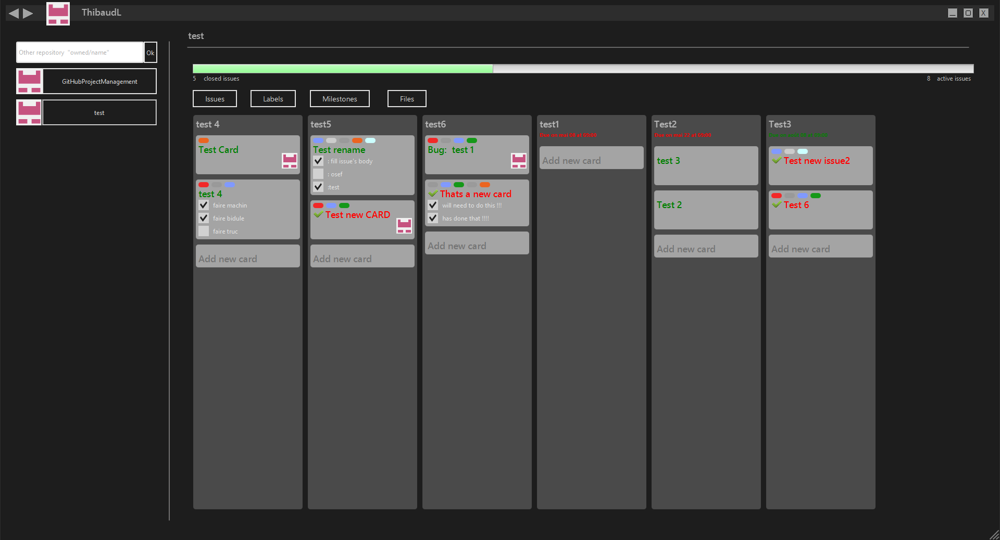

### GitHub Project Management

-------------
Management of issues and milestones just as trello in order to manage the whole project with gitHub

-------------
##### To create runable jar : (Error : Not taking the required jar for the API GitHub)
##### javafxpackager.exe -createjar -appclass application.Main -outfile C:\Users\Thibaud\Documents\test -v -nocss2bin -srcdir E:\workspace\GitHubProjectManagement\bin
-------------
